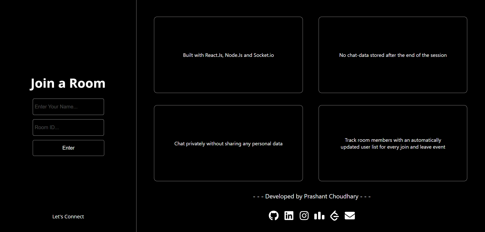

# ChatPCJ

ChatPCJ is an anonymous messaging platform that enables user connections in real-time. It offers dynamic updates for join and leave events, ensuring a seamless and engaging chat experience.

## Features

- Anonymous Messaging: ChatPCJ allows users to send messages without revealing their identities, promoting open and honest conversations.

- Real-time Communication: The application leverages the power of real-time communication to provide instant message delivery and updates.

- Dynamic User Interaction: ChatPCJ offers dynamic updates for join and leave events, making it easy for users to see who's currently active in the chat.

- Responsive UI: The user interface is built using React JS and CSS, ensuring a responsive and visually appealing chat experience.

## Technologies Used

- Backend: Node.js and Express.js
- Real-time Communication: Socket.io
- Frontend: React JS and CSS

## Getting Started

To run ChatPCJ locally, follow these steps:

1. Clone this repository and the [Chat-pcj-server](https://github.com/prashant6802/Chat-pcj-server) repository and put them in a single folder.
2. Navigate to the `server` directory and install backend dependencies using `npm install`.
3. Start the backend server using `npm start`.
4. Navigate to the `client` directory and install frontend dependencies using `npm install`.
5. Start the frontend development server using `npm start`.

Happy chatting!
